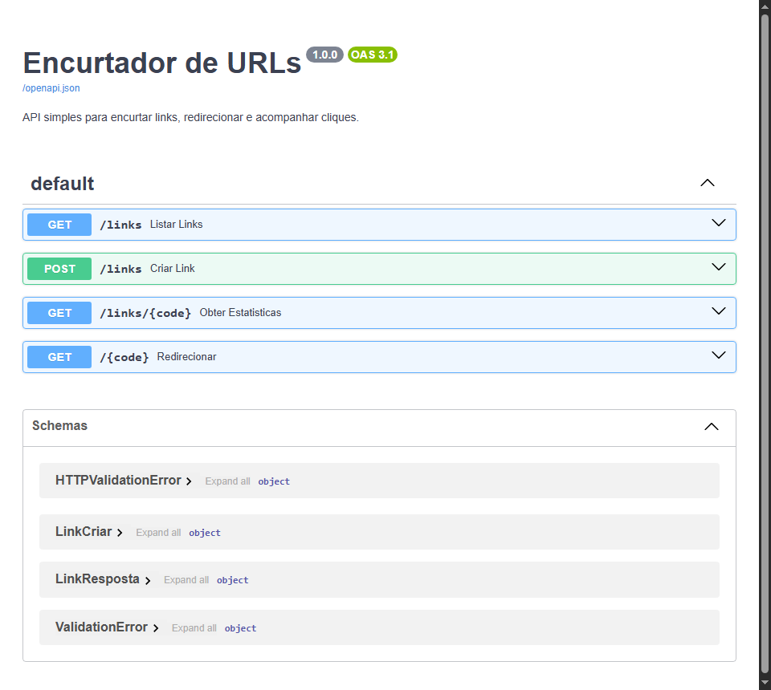

# 📌 Encurtador de URLs — API

> API REST para encurtar links, redirecionar e acompanhar cliques, com testes automatizados, CI no GitHub Actions, Docker e documentação interativa (Swagger).


## 🔗 Links

- 🚀 **Deploy:** [encurtador-url-api-5txq.onrender.com](https://encurtador-url-api-5txq.onrender.com)
- 📖 **Documentação interativa (Swagger):** [encurtador-url-api-5txq.onrender.com/docs](https://encurtador-url-api-5txq.onrender.com/docs)

> ⚠️ O backend está hospedado no plano gratuito do Render — a instância "dorme" após um tempo sem uso. A primeira requisição após a inatividade pode levar até ~50 segundos para responder.

## 🧠 Sobre o projeto

Encurtadores de URL são um clássico de portfólio porque, apesar de simples na ideia, tocam em vários problemas reais de API: geração de identificadores únicos sem colisão, redirecionamento HTTP correto, e um modelo de dados simples mas com necessidade real de contagem/estatísticas.

Usei esse projeto para praticar um stack Python mais moderno (FastAPI + SQLModel) e, principalmente, para ir além do código: adicionar testes automatizados rodando em CI a cada push, empacotar a aplicação em Docker e aproveitar a documentação OpenAPI que o FastAPI gera automaticamente.

## ✨ Funcionalidades

- `POST /links` — encurta uma URL e devolve um código único de 6 caracteres
- `GET /{code}` — redireciona para a URL original (e incrementa o contador de cliques)
- `GET /links/{code}` — estatísticas de um link (cliques, data de criação)
- `GET /links` — lista todos os links criados
- Validação de URL na entrada (Pydantic `HttpUrl`)
- Documentação interativa automática em `/docs` (Swagger UI) e `/redoc`

## 🖥️ Documentação interativa (Swagger)



## 🛠️ Tecnologias

- Python 3.12 + FastAPI
- SQLModel (SQLAlchemy + Pydantic) + SQLite
- Pytest + `TestClient` (testes de integração com banco em memória)
- Docker + docker-compose
- GitHub Actions (CI rodando os testes a cada push/PR)

## 📂 Estrutura do projeto

```
08-encurtador-url/
├── app/
│   ├── main.py        # rotas da API
│   ├── models.py       # modelo SQLModel
│   ├── schemas.py       # schemas Pydantic de entrada/saída
│   ├── database.py      # engine e sessão do banco
│   └── codigo.py        # geração do código curto
├── tests/
│   └── test_main.py
├── .github/workflows/ci.yml
├── Dockerfile
├── docker-compose.yml
├── render.yaml
├── requirements.txt
└── README.md
```

## ▶️ Como rodar localmente

```bash
# clonar o repositório
git clone https://github.com/Kashalicov/encurtador-url.git
cd encurtador-url

# instalar dependências
pip install -r requirements.txt

# rodar a API
uvicorn app.main:app --reload
```

Acesse `http://localhost:8000/docs` para testar a API pela interface do Swagger.

### Com Docker

```bash
docker compose up --build
```

## ✅ Testes

```bash
python -m pytest tests/ -v
```

Os testes rodam automaticamente a cada push/PR via GitHub Actions (veja o badge de CI no topo deste README).

## 📚 O que eu aprendi

Esse projeto foi minha primeira vez configurando CI de verdade (GitHub Actions rodando os testes a cada push) e escrevendo um Dockerfile do zero — antes eu só tinha usado localmente. Aprendi na prática a diferença entre testar com um banco real e testar com um banco em memória isolado por teste (usando `dependency_overrides` do FastAPI para trocar a sessão do banco só durante os testes), o que evita testes "sujarem" uns aos outros.

## 🚧 Possíveis melhorias futuras

- Rate limiting para evitar abuso da API pública
- Expiração de links após um período configurável
- Página de erro amigável ao acessar um código inexistente pelo navegador

## 👤 Autor

**Júnior Rodrigues**
Coordenador de T.I. na Fundação Banco de Olhos | Estudante de Ciência da Computação
[LinkedIn](https://www.linkedin.com/in/jrkdev/) · [GitHub](https://github.com/Kashalicov)
